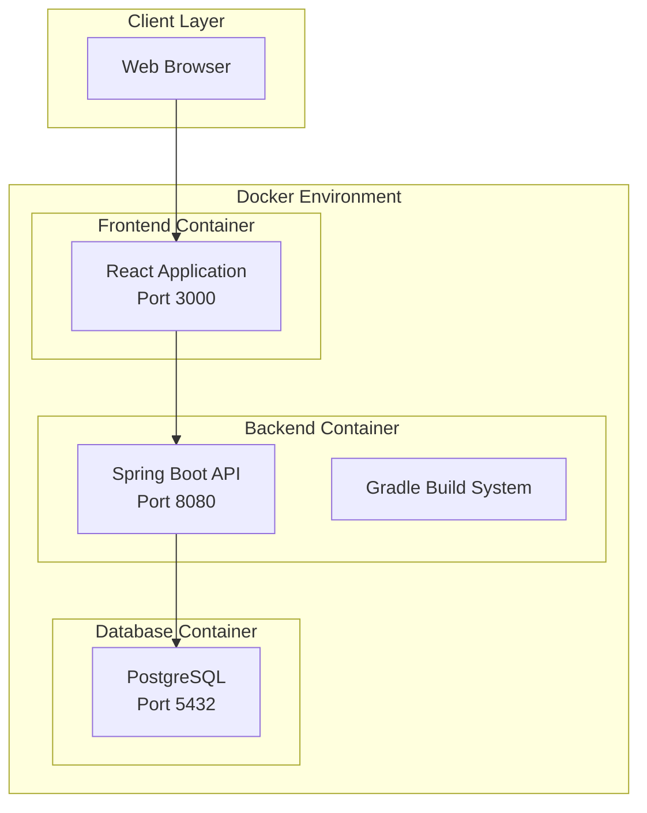

# Design Document

## Overview

The Insurance Backoffice System is a containerized web application built with a modern three-tier architecture. The system uses Java with Spring Boot for the backend API, a React frontend for the user interface, and PostgreSQL for data persistence. The entire system is containerized using Docker and orchestrated with Docker Compose for easy deployment and scalability.

## Architecture

### High-Level Architecture



### Technology Stack

**Backend:**
- Java 17+ with Spring Boot 3.x
- Gradle 8.x for build management and dependency resolution
- Spring Security for authentication and authorization
- Spring Data JPA for database operations
- Spring Web for REST API endpoints
- SpringDoc OpenAPI 3 (Swagger) for API documentation
- iText or Apache PDFBox for PDF generation
- JUnit 5 and Mockito for unit testing
- Clean Code principles: SOLID, DRY, KISS, YAGNI
- Proven patterns: Repository, Service Layer, DTO, Builder

**Frontend:**
- React 18+ with TypeScript
- Material-UI (MUI) for UI components with custom theme
- Axios for HTTP client communication
- React Router for navigation
- Jest and React Testing Library for unit tests
- Light color scheme with blue and gold accent colors

**Database:**
- PostgreSQL 15+ for data persistence
- Flyway for database migrations
- Connection pooling with HikariCP

**Infrastructure:**
- Docker containers for all components
- Docker Compose for orchestration
- Nginx (optional) for reverse proxy and static file serving

## Components and Interfaces

### Backend Components

Following Clean Code principles and proven architectural patterns:

#### 1. Controller Layer (Thin Controllers)
- **UserController**: Handles user management endpoints (Admin only) - delegates to service layer
- **PolicyController**: Manages policy CRUD operations - minimal logic, focused on HTTP concerns
- **AuthController**: Handles authentication and session management - stateless design
- **RatingController**: Provides rating table data for premium calculations - read-only operations

*Clean Code Principles Applied:*
- Single Responsibility: Each controller handles one domain
- Dependency Inversion: Controllers depend on service abstractions
- Small methods with descriptive names

#### 2. Service Layer (Business Logic)
- **UserService**: Business logic for user management - encapsulates domain rules
- **PolicyService**: Core policy management business logic - transaction boundaries
- **RatingService**: Premium calculation and rating table management - pure functions where possible
- **PdfService**: PDF document generation - focused single responsibility
- **AuthenticationService**: User authentication and authorization - security concerns isolated

*Clean Code Principles Applied:*
- Single Responsibility: Each service has one reason to change
- Open/Closed: Extensible through interfaces
- Interface Segregation: Small, focused interfaces
- DRY: Common logic extracted to utility classes

#### 3. Repository Layer (Data Access)
- **UserRepository**: Data access for user entities - extends Spring Data JPA
- **PolicyRepository**: Data access for policy entities - custom queries when needed
- **ClientRepository**: Data access for client entities - simple CRUD operations
- **VehicleRepository**: Data access for vehicle entities - optimized queries
- **RatingTableRepository**: Data access for rating tables - caching considerations

*Clean Code Principles Applied:*
- Repository Pattern: Abstracts data access
- Query methods with intention-revealing names
- No business logic in repositories

#### 4. Domain Models (Rich Domain Objects)
- **User, Client, Vehicle, Policy**: Rich domain objects with behavior
- **Value Objects**: For complex data types (Address, Money, etc.)
- **Domain Services**: For operations that don't belong to a single entity

*Clean Code Principles Applied:*
- Tell, Don't Ask: Objects expose behavior, not just data
- Encapsulation: Private fields with meaningful public methods
- Immutability where appropriate

#### 5. Security Configuration
- **SecurityConfig**: Spring Security configuration - minimal, focused
- **JwtAuthenticationFilter**: JWT token validation - single responsibility
- **UserDetailsServiceImpl**: Custom user details implementation - adapter pattern

#### 6. Common Utilities (DRY Principle)
- **ValidationUtils**: Common validation logic
- **DateUtils**: Date manipulation utilities
- **MoneyUtils**: Financial calculation utilities
- **PolicyNumberGenerator**: Unique identifier generation

### Frontend Components

#### 1. Authentication Components
- **LoginForm**: User login interface
- **AuthGuard**: Route protection based on user roles

#### 2. User Management Components (Admin only)
- **UserList**: Display and manage system users
- **UserForm**: Create and edit user accounts
- **UserDetails**: View user information

#### 3. Policy Management Components
- **PolicyList**: Display policies with search and filter
- **PolicyForm**: Create and edit policies
- **PolicyDetails**: View complete policy information
- **PdfViewer**: Display generated PDF documents

#### 4. Common Components
- **Navigation**: Main navigation menu with role-based visibility
- **Dashboard**: Landing page with system overview
- **ErrorBoundary**: Global error handling

### API Endpoints

#### Authentication Endpoints
```
POST /api/auth/login
POST /api/auth/logout
GET  /api/auth/me
```

#### User Management Endpoints (Admin only)
```
GET    /api/users
POST   /api/users
GET    /api/users/{id}
PUT    /api/users/{id}
DELETE /api/users/{id}
```

#### Policy Management Endpoints
```
GET    /api/policies
POST   /api/policies
GET    /api/policies/{id}
PUT    /api/policies/{id}
DELETE /api/policies/{id}
GET    /api/policies/client/{clientId}
POST   /api/policies/{id}/pdf
```

#### Rating Endpoints
```
GET    /api/rating/tables/{insuranceType}
POST   /api/rating/calculate
```

## Data Models

### Core Entities

#### User Entity (Clean Code Example)
```java
@Entity
@Table(name = "users")
public class User {
    @Id
    @GeneratedValue(strategy = GenerationType.IDENTITY)
    private Long id;
    
    @Column(nullable = false)
    private String firstName;
    
    @Column(nullable = false)
    private String lastName;
    
    @Column(unique = true, nullable = false)
    private String email;
    
    @Column(nullable = false)
    private String password;
    
    @Enumerated(EnumType.STRING)
    private UserRole role;
    
    @CreationTimestamp
    private LocalDateTime createdAt;
    
    @UpdateTimestamp
    private LocalDateTime updatedAt;
    
    // Clean Code: Meaningful method names, encapsulation
    public String getFullName() {
        return firstName + " " + lastName;
    }
    
    public boolean isAdmin() {
        return UserRole.ADMIN.equals(role);
    }
    
    public boolean canManageUsers() {
        return isAdmin();
    }
    
    public boolean canIssuePolicies() {
        return UserRole.OPERATOR.equals(role);
    }
    
    // Builder pattern for clean object creation
    public static class Builder {
        private String firstName;
        private String lastName;
        private String email;
        private String password;
        private UserRole role;
        
        public Builder firstName(String firstName) {
            this.firstName = firstName;
            return this;
        }
        
        public Builder lastName(String lastName) {
            this.lastName = lastName;
            return this;
        }
        
        public Builder email(String email) {
            this.email = email;
            return this;
        }
        
        public Builder password(String password) {
            this.password = password;
            return this;
        }
        
        public Builder role(UserRole role) {
            this.role = role;
            return this;
        }
        
        public User build() {
            User user = new User();
            user.firstName = this.firstName;
            user.lastName = this.lastName;
            user.email = this.email;
            user.password = this.password;
            user.role = this.role;
            return user;
        }
    }
}
```

#### Client Entity
```java
@Entity
@Table(name = "clients")
public class Client {
    @Id
    @GeneratedValue(strategy = GenerationType.IDENTITY)
    private Long id;
    
    @Column(nullable = false)
    private String fullName;
    
    @Column(unique = true, nullable = false)
    private String pesel;
    
    @Column(nullable = false)
    private String address;
    
    @Column(nullable = false)
    private String email;
    
    @Column(nullable = false)
    private String phoneNumber;
    
    @OneToMany(mappedBy = "client", cascade = CascadeType.ALL)
    private List<Policy> policies;
}
```

#### Vehicle Entity
```java
@Entity
@Table(name = "vehicles")
public class Vehicle {
    @Id
    @GeneratedValue(strategy = GenerationType.IDENTITY)
    private Long id;
    
    @Column(nullable = false)
    private String make;
    
    @Column(nullable = false)
    private String model;
    
    @Column(nullable = false)
    private Integer yearOfManufacture;
    
    @Column(unique = true, nullable = false)
    private String registrationNumber;
    
    @Column(unique = true, nullable = false)
    private String vin;
    
    @Column(nullable = false)
    private Integer engineCapacity;
    
    @Column(nullable = false)
    private Integer power;
    
    @Column(nullable = false)
    private LocalDate firstRegistrationDate;
    
    @OneToMany(mappedBy = "vehicle", cascade = CascadeType.ALL)
    private List<Policy> policies;
}
```

#### Policy Entity
```java
@Entity
@Table(name = "policies")
public class Policy {
    @Id
    @GeneratedValue(strategy = GenerationType.IDENTITY)
    private Long id;
    
    @Column(unique = true, nullable = false)
    private String policyNumber;
    
    @Column(nullable = false)
    private LocalDate issueDate;
    
    @Column(nullable = false)
    private LocalDate startDate;
    
    @Column(nullable = false)
    private LocalDate endDate;
    
    @Enumerated(EnumType.STRING)
    private PolicyStatus status; // ACTIVE, CANCELED, EXPIRED
    
    @Enumerated(EnumType.STRING)
    private InsuranceType insuranceType; // OC, AC, NNW
    
    @Column(nullable = false)
    private BigDecimal premium;
    
    @Column
    private BigDecimal discountSurcharge;
    
    @ManyToOne(fetch = FetchType.LAZY)
    @JoinColumn(name = "client_id", nullable = false)
    private Client client;
    
    @ManyToOne(fetch = FetchType.LAZY)
    @JoinColumn(name = "vehicle_id", nullable = false)
    private Vehicle vehicle;
    
    @OneToOne(mappedBy = "policy", cascade = CascadeType.ALL)
    private PolicyDetails policyDetails;
}
```

#### Policy Details Entity (Insurance Type Specific)
```java
@Entity
@Table(name = "policy_details")
public class PolicyDetails {
    @Id
    @GeneratedValue(strategy = GenerationType.IDENTITY)
    private Long id;
    
    @OneToOne(fetch = FetchType.LAZY)
    @JoinColumn(name = "policy_id", nullable = false)
    private Policy policy;
    
    // OC Insurance fields
    @Column
    private BigDecimal guaranteedSum;
    
    @Column
    private String coverageArea;
    
    // AC Insurance fields
    @Enumerated(EnumType.STRING)
    private ACVariant acVariant; // STANDARD, MAXIMUM
    
    @Column
    private BigDecimal sumInsured;
    
    @Column
    private String coverageScope;
    
    @Column
    private BigDecimal deductible;
    
    @Column
    private String workshopType;
    
    // NNW Insurance fields
    @Column
    private String coveredPersons;
}
```

#### Rating Table Entity
```java
@Entity
@Table(name = "rating_tables")
public class RatingTable {
    @Id
    @GeneratedValue(strategy = GenerationType.IDENTITY)
    private Long id;
    
    @Enumerated(EnumType.STRING)
    private InsuranceType insuranceType;
    
    @Column(nullable = false)
    private String ratingKey;
    
    @Column(nullable = false)
    private BigDecimal multiplier;
    
    @Column(nullable = false)
    private LocalDate validFrom;
    
    @Column
    private LocalDate validTo;
}
```

### Database Schema

The PostgreSQL database will use the following schema structure:

```sql
-- Users table
CREATE TABLE users (
    id BIGSERIAL PRIMARY KEY,
    first_name VARCHAR(100) NOT NULL,
    last_name VARCHAR(100) NOT NULL,
    email VARCHAR(255) UNIQUE NOT NULL,
    password VARCHAR(255) NOT NULL,
    role VARCHAR(20) NOT NULL,
    created_at TIMESTAMP DEFAULT CURRENT_TIMESTAMP,
    updated_at TIMESTAMP DEFAULT CURRENT_TIMESTAMP
);

-- Clients table
CREATE TABLE clients (
    id BIGSERIAL PRIMARY KEY,
    full_name VARCHAR(200) NOT NULL,
    pesel VARCHAR(11) UNIQUE NOT NULL,
    address TEXT NOT NULL,
    email VARCHAR(255) NOT NULL,
    phone_number VARCHAR(20) NOT NULL
);

-- Vehicles table
CREATE TABLE vehicles (
    id BIGSERIAL PRIMARY KEY,
    make VARCHAR(50) NOT NULL,
    model VARCHAR(50) NOT NULL,
    year_of_manufacture INTEGER NOT NULL,
    registration_number VARCHAR(20) UNIQUE NOT NULL,
    vin VARCHAR(17) UNIQUE NOT NULL,
    engine_capacity INTEGER NOT NULL,
    power INTEGER NOT NULL,
    first_registration_date DATE NOT NULL
);

-- Policies table
CREATE TABLE policies (
    id BIGSERIAL PRIMARY KEY,
    policy_number VARCHAR(50) UNIQUE NOT NULL,
    issue_date DATE NOT NULL,
    start_date DATE NOT NULL,
    end_date DATE NOT NULL,
    status VARCHAR(20) NOT NULL,
    insurance_type VARCHAR(10) NOT NULL,
    premium DECIMAL(10,2) NOT NULL,
    discount_surcharge DECIMAL(10,2),
    client_id BIGINT NOT NULL REFERENCES clients(id),
    vehicle_id BIGINT NOT NULL REFERENCES vehicles(id)
);

-- Policy details table
CREATE TABLE policy_details (
    id BIGSERIAL PRIMARY KEY,
    policy_id BIGINT NOT NULL REFERENCES policies(id),
    guaranteed_sum DECIMAL(12,2),
    coverage_area VARCHAR(100),
    ac_variant VARCHAR(20),
    sum_insured DECIMAL(12,2),
    coverage_scope TEXT,
    deductible DECIMAL(10,2),
    workshop_type VARCHAR(50),
    covered_persons TEXT
);

-- Rating tables
CREATE TABLE rating_tables (
    id BIGSERIAL PRIMARY KEY,
    insurance_type VARCHAR(10) NOT NULL,
    rating_key VARCHAR(100) NOT NULL,
    multiplier DECIMAL(5,4) NOT NULL,
    valid_from DATE NOT NULL,
    valid_to DATE
);
```

## Error Handling

### Backend Error Handling

#### Global Exception Handler
```java
@ControllerAdvice
public class GlobalExceptionHandler {
    
    @ExceptionHandler(ValidationException.class)
    public ResponseEntity<ErrorResponse> handleValidation(ValidationException ex) {
        return ResponseEntity.badRequest()
            .body(new ErrorResponse("VALIDATION_ERROR", ex.getMessage()));
    }
    
    @ExceptionHandler(EntityNotFoundException.class)
    public ResponseEntity<ErrorResponse> handleNotFound(EntityNotFoundException ex) {
        return ResponseEntity.notFound()
            .body(new ErrorResponse("NOT_FOUND", ex.getMessage()));
    }
    
    @ExceptionHandler(AccessDeniedException.class)
    public ResponseEntity<ErrorResponse> handleAccessDenied(AccessDeniedException ex) {
        return ResponseEntity.status(HttpStatus.FORBIDDEN)
            .body(new ErrorResponse("ACCESS_DENIED", "Insufficient permissions"));
    }
}
```

#### Custom Exceptions
- **ValidationException**: For business rule violations
- **EntityNotFoundException**: For missing resources
- **PolicyCalculationException**: For rating calculation errors
- **PdfGenerationException**: For PDF creation failures

### Frontend Error Handling

#### Error Boundary Component
```typescript
class ErrorBoundary extends React.Component {
    constructor(props) {
        super(props);
        this.state = { hasError: false, error: null };
    }
    
    static getDerivedStateFromError(error) {
        return { hasError: true, error };
    }
    
    componentDidCatch(error, errorInfo) {
        console.error('Application error:', error, errorInfo);
    }
    
    render() {
        if (this.state.hasError) {
            return <ErrorFallback error={this.state.error} />;
        }
        return this.props.children;
    }
}
```

#### HTTP Error Handling
- **401 Unauthorized**: Redirect to login page
- **403 Forbidden**: Show access denied message
- **404 Not Found**: Show resource not found message
- **500 Server Error**: Show generic error message with retry option

## Testing Strategy

### Backend Testing Strategy

#### Testing Pyramid Approach
1. **Unit Tests (70%)**: Fast, isolated tests with mocks
2. **Integration Tests (20%)**: Test component interactions
3. **End-to-End Tests (10%)**: Full system testing

#### API Unit Tests with Mocks (Primary Testing Strategy)
- **Controllers**: Use `@WebMvcTest` with `@MockBean` for services
- **Services**: Use `@ExtendWith(MockitoExtension.class)` with `@Mock` dependencies
- **Repositories**: Use `@DataJpaTest` for database-specific tests

#### Unit Tests with JUnit 5 and Mockito (Clean Code Testing)
```java
@ExtendWith(MockitoExtension.class)
class PolicyServiceTest {
    
    @Mock
    private PolicyRepository policyRepository;
    
    @Mock
    private RatingService ratingService;
    
    @InjectMocks
    private PolicyService policyService;
    
    @Test
    void shouldCreatePolicyWithCorrectPremium() {
        // Given - Arrange
        PolicyRequest request = createValidPolicyRequest();
        BigDecimal expectedPremium = BigDecimal.valueOf(1200.00);
        when(ratingService.calculatePremium(any())).thenReturn(expectedPremium);
        
        // When - Act
        Policy result = policyService.createPolicy(request);
        
        // Then - Assert
        assertThat(result.getPremium()).isEqualTo(expectedPremium);
        verify(policyRepository).save(any(Policy.class));
    }
    
    @Test
    void shouldThrowExceptionWhenClientNotFound() {
        // Given
        PolicyRequest request = createPolicyRequestWithInvalidClient();
        
        // When & Then
        assertThatThrownBy(() -> policyService.createPolicy(request))
            .isInstanceOf(EntityNotFoundException.class)
            .hasMessage("Client not found");
    }
    
    // Clean Code: Descriptive test helper methods
    private PolicyRequest createValidPolicyRequest() {
        return PolicyRequest.builder()
            .clientId(1L)
            .vehicleId(1L)
            .insuranceType(InsuranceType.OC)
            .startDate(LocalDate.now())
            .endDate(LocalDate.now().plusYears(1))
            .build();
    }
    
    private PolicyRequest createPolicyRequestWithInvalidClient() {
        return PolicyRequest.builder()
            .clientId(999L) // Non-existent client
            .vehicleId(1L)
            .insuranceType(InsuranceType.OC)
            .build();
    }
}
```

#### API Unit Tests with Mocks (Preferred for Controllers)
```java
@WebMvcTest(PolicyController.class)
class PolicyControllerTest {
    
    @Autowired
    private MockMvc mockMvc;
    
    @MockBean
    private PolicyService policyService;
    
    @MockBean
    private AuthenticationService authService;
    
    @Test
    void shouldCreatePolicySuccessfully() throws Exception {
        // Given
        CreatePolicyRequest request = new CreatePolicyRequest(1L, 1L, InsuranceType.OC, 
            LocalDate.now(), LocalDate.now().plusYears(1), null);
        Policy mockPolicy = createMockPolicy();
        
        when(policyService.createPolicy(any(CreatePolicyRequest.class)))
            .thenReturn(mockPolicy);
        
        // When & Then
        mockMvc.perform(post("/api/policies")
                .contentType(MediaType.APPLICATION_JSON)
                .content(objectMapper.writeValueAsString(request)))
                .andExpect(status().isCreated())
                .andExpect(jsonPath("$.policyNumber").value("POL-001"))
                .andExpect(jsonPath("$.insuranceType").value("OC"));
        
        verify(policyService).createPolicy(any(CreatePolicyRequest.class));
    }
    
    @Test
    void shouldReturnBadRequestWhenInvalidData() throws Exception {
        // Given
        CreatePolicyRequest invalidRequest = new CreatePolicyRequest(null, null, null, null, null, null);
        
        // When & Then
        mockMvc.perform(post("/api/policies")
                .contentType(MediaType.APPLICATION_JSON)
                .content(objectMapper.writeValueAsString(invalidRequest)))
                .andExpect(status().isBadRequest())
                .andExpect(jsonPath("$.errors").exists());
        
        verifyNoInteractions(policyService);
    }
    
    private Policy createMockPolicy() {
        return Policy.builder()
            .id(1L)
            .policyNumber("POL-001")
            .insuranceType(InsuranceType.OC)
            .status(PolicyStatus.ACTIVE)
            .build();
    }
}
```

#### Integration Tests with TestContainers (For Repository Layer)
```java
@DataJpaTest
@Testcontainers
class PolicyRepositoryIntegrationTest {
    
    @Container
    static PostgreSQLContainer<?> postgres = new PostgreSQLContainer<>("postgres:15")
            .withDatabaseName("testdb")
            .withUsername("test")
            .withPassword("test");
    
    @Autowired
    private TestEntityManager entityManager;
    
    @Autowired
    private PolicyRepository policyRepository;
    
    @Test
    void shouldFindPoliciesByClientId() {
        // Given
        Client client = createAndPersistClient();
        Policy policy = createAndPersistPolicy(client);
        
        // When
        List<Policy> policies = policyRepository.findByClientId(client.getId());
        
        // Then
        assertThat(policies).hasSize(1);
        assertThat(policies.get(0).getPolicyNumber()).isEqualTo(policy.getPolicyNumber());
    }
}
```

### Frontend Testing

#### Component Tests with Jest and React Testing Library
```typescript
describe('PolicyForm', () => {
    test('should validate required fields', async () => {
        render(<PolicyForm onSubmit={mockSubmit} />);
        
        fireEvent.click(screen.getByText('Submit'));
        
        expect(await screen.findByText('Client name is required')).toBeInTheDocument();
        expect(await screen.findByText('Vehicle registration is required')).toBeInTheDocument();
    });
    
    test('should submit form with valid data', async () => {
        const mockSubmit = jest.fn();
        render(<PolicyForm onSubmit={mockSubmit} />);
        
        fireEvent.change(screen.getByLabelText('Client Name'), { target: { value: 'John Doe' } });
        fireEvent.change(screen.getByLabelText('Registration'), { target: { value: 'ABC123' } });
        fireEvent.click(screen.getByText('Submit'));
        
        await waitFor(() => {
            expect(mockSubmit).toHaveBeenCalledWith(expect.objectContaining({
                clientName: 'John Doe',
                registration: 'ABC123'
            }));
        });
    });
});
```

### Build and Deployment Configuration

#### Gradle Build Configuration (build.gradle)
```gradle
plugins {
    id 'java'
    id 'org.springframework.boot' version '3.2.0'
    id 'io.spring.dependency-management' version '1.1.4'
}

java {
    sourceCompatibility = '17'
}

repositories {
    mavenCentral()
}

dependencies {
    implementation 'org.springframework.boot:spring-boot-starter-web'
    implementation 'org.springframework.boot:spring-boot-starter-data-jpa'
    implementation 'org.springframework.boot:spring-boot-starter-security'
    implementation 'org.springframework.boot:spring-boot-starter-validation'
    implementation 'org.postgresql:postgresql'
    implementation 'com.itextpdf:itext7-core:7.2.5'
    implementation 'io.jsonwebtoken:jjwt-api:0.11.5'
    
    // Swagger/OpenAPI documentation
    implementation 'org.springdoc:springdoc-openapi-starter-webmvc-ui:2.2.0'
    implementation 'org.springdoc:springdoc-openapi-starter-webmvc-api:2.2.0'
    
    testImplementation 'org.springframework.boot:spring-boot-starter-test'
    testImplementation 'org.testcontainers:postgresql'
    testImplementation 'org.testcontainers:junit-jupiter'
}

test {
    useJUnitPlatform()
}
```

#### Docker Compose Configuration
```yaml
version: '3.8'
services:
  database:
    image: postgres:15
    environment:
      POSTGRES_DB: insurance_db
      POSTGRES_USER: insurance_user
      POSTGRES_PASSWORD: insurance_pass
    ports:
      - "5432:5432"
    volumes:
      - postgres_data:/var/lib/postgresql/data

  backend:
    build: ./backend
    ports:
      - "8080:8080"
    environment:
      SPRING_DATASOURCE_URL: jdbc:postgresql://database:5432/insurance_db
      SPRING_DATASOURCE_USERNAME: insurance_user
      SPRING_DATASOURCE_PASSWORD: insurance_pass
    depends_on:
      - database

  frontend:
    build: ./frontend
    ports:
      - "3000:3000"
    depends_on:
      - backend

volumes:
  postgres_data:
```

This design provides a robust, scalable foundation for the Insurance Backoffice System using modern Java development practices with Gradle, comprehensive testing strategies, and containerized deployment.
#
# Clean Code Standards and Practices

### Code Organization Principles

#### Package Structure (Clean Architecture)
```
src/main/java/com/insurance/backoffice/
├── domain/           # Core business logic (entities, value objects, domain services)
├── application/      # Use cases and application services
├── infrastructure/   # External concerns (repositories, web, security)
├── interfaces/       # Controllers and DTOs
└── config/          # Configuration classes
```

#### Naming Conventions
- **Classes**: PascalCase with intention-revealing names (`PolicyCalculationService`, not `PolicyService`)
- **Methods**: camelCase with verb-noun pattern (`calculatePremium`, `validatePolicy`)
- **Variables**: camelCase with meaningful names (`totalPremium`, not `tp`)
- **Constants**: UPPER_SNAKE_CASE (`MAX_POLICY_DURATION`)
- **Packages**: lowercase with dots (`com.insurance.backoffice.domain.policy`)

#### Method Design Principles
- **Single Responsibility**: Each method does one thing well
- **Small Methods**: Aim for 5-15 lines per method
- **Pure Functions**: Prefer methods without side effects where possible
- **Meaningful Names**: Method names should explain what they do
- **Consistent Abstraction Level**: All statements in a method should be at the same level

#### Error Handling Standards
```java
// Good: Specific exceptions with meaningful messages
public Policy createPolicy(PolicyRequest request) {
    validatePolicyRequest(request);
    
    Client client = clientRepository.findById(request.getClientId())
        .orElseThrow(() -> new ClientNotFoundException(
            "Client with ID " + request.getClientId() + " not found"));
    
    return buildPolicyFromRequest(request, client);
}

// Good: Fail-fast validation
private void validatePolicyRequest(PolicyRequest request) {
    if (request == null) {
        throw new IllegalArgumentException("Policy request cannot be null");
    }
    if (request.getStartDate().isAfter(request.getEndDate())) {
        throw new ValidationException("Start date must be before end date");
    }
}
```

#### DTO Pattern for Clean API Design
```java
// Request DTOs - immutable with validation
public record CreatePolicyRequest(
    @NotNull Long clientId,
    @NotNull Long vehicleId,
    @NotNull InsuranceType insuranceType,
    @NotNull @Future LocalDate startDate,
    @NotNull @Future LocalDate endDate,
    BigDecimal discountSurcharge
) {
    // Validation in constructor if needed
    public CreatePolicyRequest {
        if (startDate != null && endDate != null && startDate.isAfter(endDate)) {
            throw new IllegalArgumentException("Start date must be before end date");
        }
    }
}

// Response DTOs - focused on client needs
public record PolicyResponse(
    Long id,
    String policyNumber,
    String clientName,
    String vehicleRegistration,
    InsuranceType insuranceType,
    LocalDate startDate,
    LocalDate endDate,
    BigDecimal premium,
    PolicyStatus status
) {}
```

### Testing Standards

#### Test Structure (AAA Pattern)
```java
@Test
void shouldCalculateCorrectPremiumForOCInsurance() {
    // Arrange - Set up test data and expectations
    Vehicle vehicle = createTestVehicle();
    RatingFactors factors = createRatingFactors();
    BigDecimal expectedBasePremium = BigDecimal.valueOf(800.00);
    
    // Act - Execute the method under test
    BigDecimal actualPremium = ratingService.calculateOCPremium(vehicle, factors);
    
    // Assert - Verify the results
    assertThat(actualPremium).isEqualByComparingTo(expectedBasePremium);
}
```

#### Test Naming Convention
- Format: `should[ExpectedBehavior]When[StateUnderTest]`
- Examples:
  - `shouldThrowExceptionWhenClientNotFound`
  - `shouldCalculateCorrectPremiumWhenAllFactorsProvided`
  - `shouldReturnEmptyListWhenNoPoliciesExist`

#### Test Data Builders (Object Mother Pattern)
```java
public class PolicyTestDataBuilder {
    private Long clientId = 1L;
    private Long vehicleId = 1L;
    private InsuranceType insuranceType = InsuranceType.OC;
    private LocalDate startDate = LocalDate.now();
    private LocalDate endDate = LocalDate.now().plusYears(1);
    
    public static PolicyTestDataBuilder aPolicy() {
        return new PolicyTestDataBuilder();
    }
    
    public PolicyTestDataBuilder withClientId(Long clientId) {
        this.clientId = clientId;
        return this;
    }
    
    public PolicyTestDataBuilder withInsuranceType(InsuranceType type) {
        this.insuranceType = type;
        return this;
    }
    
    public PolicyRequest build() {
        return new PolicyRequest(clientId, vehicleId, insuranceType, startDate, endDate);
    }
}

// Usage in tests
@Test
void shouldCreateACPolicy() {
    PolicyRequest request = aPolicy()
        .withInsuranceType(InsuranceType.AC)
        .withClientId(2L)
        .build();
    
    Policy result = policyService.createPolicy(request);
    
    assertThat(result.getInsuranceType()).isEqualTo(InsuranceType.AC);
}
```

### Code Quality Tools Integration

#### Gradle Configuration for Code Quality
```gradle
plugins {
    id 'checkstyle'
    id 'pmd'
    id 'jacoco'
    id 'com.github.spotbugs' version '5.0.14'
}

checkstyle {
    toolVersion = '10.12.4'
    configFile = file('config/checkstyle/checkstyle.xml')
}

pmd {
    toolVersion = '6.55.0'
    ruleSetFiles = files('config/pmd/ruleset.xml')
}

jacoco {
    toolVersion = '0.8.8'
}

jacocoTestReport {
    reports {
        xml.required = true
        html.required = true
    }
    afterEvaluate {
        classDirectories.setFrom(files(classDirectories.files.collect {
            fileTree(dir: it, exclude: [
                '**/config/**',
                '**/dto/**',
                '**/*Application.class'
            ])
        }))
    }
}

test {
    finalizedBy jacocoTestReport
    jacocoTestReport.dependsOn test
}
```

### Documentation Standards

#### JavaDoc for Public APIs
```java
/**
 * Calculates insurance premium based on vehicle characteristics and rating factors.
 * 
 * @param vehicle the vehicle to be insured, must not be null
 * @param factors rating factors including driver age, vehicle age, etc.
 * @return calculated premium amount, never null
 * @throws ValidationException if vehicle or factors are invalid
 * @throws RatingException if premium cannot be calculated
 */
public BigDecimal calculatePremium(Vehicle vehicle, RatingFactors factors) {
    // Implementation
}
```

#### README Documentation Structure
```markdown
# Insurance Backoffice System

## Quick Start
- Prerequisites
- Running the application
- API documentation

## Development
- Code standards
- Testing guidelines
- Build and deployment

## Architecture
- High-level overview
- Key design decisions
- Technology choices
```

This enhanced design now emphasizes clean code principles, proven standards, and maintainable practices throughout the entire system architecture.
### API
 Testing Best Practices with Mocks

#### Controller Testing Strategy
```java
// Always use @WebMvcTest for controller unit tests
@WebMvcTest(UserController.class)
class UserControllerTest {
    
    @Autowired
    private MockMvc mockMvc;
    
    @MockBean  // Mock all service dependencies
    private UserService userService;
    
    @MockBean
    private AuthenticationService authService;
    
    @Test
    void shouldReturnUserListForAdmin() throws Exception {
        // Given - Mock service behavior
        List<User> mockUsers = Arrays.asList(
            createMockUser(1L, "John", "Doe", UserRole.ADMIN),
            createMockUser(2L, "Jane", "Smith", UserRole.OPERATOR)
        );
        when(userService.getAllUsers()).thenReturn(mockUsers);
        
        // When & Then - Test HTTP layer only
        mockMvc.perform(get("/api/users")
                .header("Authorization", "Bearer valid-token"))
                .andExpect(status().isOk())
                .andExpect(jsonPath("$", hasSize(2)))
                .andExpect(jsonPath("$[0].firstName").value("John"))
                .andExpect(jsonPath("$[1].firstName").value("Jane"));
        
        // Verify service interaction
        verify(userService).getAllUsers();
    }
    
    @Test
    void shouldReturnForbiddenForOperatorAccessingUsers() throws Exception {
        // Given - Mock authentication to return operator role
        when(authService.getCurrentUserRole()).thenReturn(UserRole.OPERATOR);
        
        // When & Then
        mockMvc.perform(get("/api/users")
                .header("Authorization", "Bearer operator-token"))
                .andExpect(status().isForbidden());
        
        // Verify service was not called
        verifyNoInteractions(userService);
    }
}
```

#### Service Testing with Mocks
```java
@ExtendWith(MockitoExtension.class)
class UserServiceTest {
    
    @Mock
    private UserRepository userRepository;
    
    @Mock
    private PasswordEncoder passwordEncoder;
    
    @InjectMocks
    private UserService userService;
    
    @Test
    void shouldCreateUserWithEncodedPassword() {
        // Given
        CreateUserRequest request = new CreateUserRequest("John", "Doe", 
            "john@example.com", "password123", UserRole.OPERATOR);
        String encodedPassword = "encoded-password";
        
        when(passwordEncoder.encode("password123")).thenReturn(encodedPassword);
        when(userRepository.save(any(User.class))).thenAnswer(invocation -> {
            User user = invocation.getArgument(0);
            user.setId(1L);
            return user;
        });
        
        // When
        User result = userService.createUser(request);
        
        // Then
        assertThat(result.getPassword()).isEqualTo(encodedPassword);
        verify(passwordEncoder).encode("password123");
        verify(userRepository).save(any(User.class));
    }
    
    @Test
    void shouldThrowExceptionWhenEmailAlreadyExists() {
        // Given
        CreateUserRequest request = new CreateUserRequest("John", "Doe", 
            "existing@example.com", "password123", UserRole.OPERATOR);
        
        when(userRepository.existsByEmail("existing@example.com")).thenReturn(true);
        
        // When & Then
        assertThatThrownBy(() -> userService.createUser(request))
            .isInstanceOf(EmailAlreadyExistsException.class)
            .hasMessage("User with email existing@example.com already exists");
        
        verify(userRepository).existsByEmail("existing@example.com");
        verify(userRepository, never()).save(any(User.class));
    }
}
```

#### Mock Configuration Best Practices
```java
// Use @MockBean in Spring tests for dependency injection
@MockBean
private PolicyService policyService;

// Use @Mock in pure unit tests
@Mock
private PolicyRepository policyRepository;

// Use @Spy when you need partial mocking
@Spy
private PolicyValidator policyValidator;

// Use @InjectMocks to inject mocked dependencies
@InjectMocks
private PolicyService policyService;

// Configure mock behavior in setup method for common scenarios
@BeforeEach
void setUp() {
    // Common mock setup
    when(authService.getCurrentUser()).thenReturn(createMockUser());
    when(dateTimeService.getCurrentDate()).thenReturn(LocalDate.of(2024, 1, 1));
}
```

#### Testing Error Scenarios with Mocks
```java
@Test
void shouldHandleRepositoryExceptionGracefully() {
    // Given
    CreatePolicyRequest request = createValidPolicyRequest();
    when(policyRepository.save(any(Policy.class)))
        .thenThrow(new DataAccessException("Database connection failed") {});
    
    // When & Then
    assertThatThrownBy(() -> policyService.createPolicy(request))
        .isInstanceOf(PolicyCreationException.class)
        .hasMessage("Failed to create policy due to system error")
        .hasCauseInstanceOf(DataAccessException.class);
}

@Test
void shouldRetryOnTransientFailures() {
    // Given
    CreatePolicyRequest request = createValidPolicyRequest();
    Policy expectedPolicy = createMockPolicy();
    
    when(policyRepository.save(any(Policy.class)))
        .thenThrow(new TransientDataAccessException("Temporary failure") {})
        .thenReturn(expectedPolicy); // Succeeds on retry
    
    // When
    Policy result = policyService.createPolicy(request);
    
    // Then
    assertThat(result).isEqualTo(expectedPolicy);
    verify(policyRepository, times(2)).save(any(Policy.class));
}
```

This testing approach ensures:
- **Fast execution**: No database or external dependencies
- **Isolation**: Each test focuses on one component
- **Reliability**: Tests don't fail due to external factors
- **Clear intent**: Mocks make test scenarios explicit
- **Easy maintenance**: Changes to dependencies don't break unrelated tests## API 
Documentation with Swagger/OpenAPI

### OpenAPI Configuration

#### Swagger Configuration Class
```java
@Configuration
@OpenAPIDefinition(
    info = @Info(
        title = "Insurance Backoffice API",
        version = "1.0.0",
        description = "REST API for managing car insurance policies",
        contact = @Contact(
            name = "Development Team",
            email = "dev@insurance.com"
        ),
        license = @License(
            name = "MIT License",
            url = "https://opensource.org/licenses/MIT"
        )
    ),
    servers = {
        @Server(url = "http://localhost:8080", description = "Development server"),
        @Server(url = "https://api.insurance.com", description = "Production server")
    }
)
@SecurityScheme(
    name = "bearerAuth",
    type = SecuritySchemeType.HTTP,
    bearerFormat = "JWT",
    scheme = "bearer"
)
public class OpenApiConfig {
    
    @Bean
    public GroupedOpenApi publicApi() {
        return GroupedOpenApi.builder()
                .group("public")
                .pathsToMatch("/api/**")
                .build();
    }
    
    @Bean
    public GroupedOpenApi adminApi() {
        return GroupedOpenApi.builder()
                .group("admin")
                .pathsToMatch("/api/users/**")
                .build();
    }
}
```

### Controller Documentation Examples

#### Policy Controller with Swagger Annotations
```java
@RestController
@RequestMapping("/api/policies")
@Tag(name = "Policy Management", description = "Operations for managing insurance policies")
@SecurityRequirement(name = "bearerAuth")
public class PolicyController {
    
    private final PolicyService policyService;
    
    @Operation(
        summary = "Create a new insurance policy",
        description = "Creates a new insurance policy for a client and vehicle. Requires OPERATOR or ADMIN role.",
        responses = {
            @ApiResponse(
                responseCode = "201",
                description = "Policy created successfully",
                content = @Content(
                    mediaType = "application/json",
                    schema = @Schema(implementation = PolicyResponse.class)
                )
            ),
            @ApiResponse(
                responseCode = "400",
                description = "Invalid request data",
                content = @Content(
                    mediaType = "application/json",
                    schema = @Schema(implementation = ErrorResponse.class)
                )
            ),
            @ApiResponse(
                responseCode = "401",
                description = "Authentication required"
            ),
            @ApiResponse(
                responseCode = "403",
                description = "Insufficient permissions"
            )
        }
    )
    @PostMapping
    @PreAuthorize("hasRole('OPERATOR') or hasRole('ADMIN')")
    public ResponseEntity<PolicyResponse> createPolicy(
            @Parameter(description = "Policy creation request", required = true)
            @Valid @RequestBody CreatePolicyRequest request) {
        
        Policy policy = policyService.createPolicy(request);
        PolicyResponse response = PolicyMapper.toResponse(policy);
        return ResponseEntity.status(HttpStatus.CREATED).body(response);
    }
    
    @Operation(
        summary = "Get policy by ID",
        description = "Retrieves a specific policy by its unique identifier",
        responses = {
            @ApiResponse(
                responseCode = "200",
                description = "Policy found",
                content = @Content(
                    mediaType = "application/json",
                    schema = @Schema(implementation = PolicyResponse.class)
                )
            ),
            @ApiResponse(
                responseCode = "404",
                description = "Policy not found"
            )
        }
    )
    @GetMapping("/{id}")
    public ResponseEntity<PolicyResponse> getPolicyById(
            @Parameter(description = "Policy ID", required = true, example = "1")
            @PathVariable Long id) {
        
        Policy policy = policyService.findById(id);
        PolicyResponse response = PolicyMapper.toResponse(policy);
        return ResponseEntity.ok(response);
    }
    
    @Operation(
        summary = "Generate policy PDF",
        description = "Generates a PDF document for the specified policy",
        responses = {
            @ApiResponse(
                responseCode = "200",
                description = "PDF generated successfully",
                content = @Content(
                    mediaType = "application/pdf"
                )
            ),
            @ApiResponse(
                responseCode = "404",
                description = "Policy not found"
            ),
            @ApiResponse(
                responseCode = "500",
                description = "PDF generation failed"
            )
        }
    )
    @PostMapping("/{id}/pdf")
    public ResponseEntity<byte[]> generatePolicyPdf(
            @Parameter(description = "Policy ID", required = true)
            @PathVariable Long id) {
        
        byte[] pdfContent = policyService.generatePolicyPdf(id);
        
        HttpHeaders headers = new HttpHeaders();
        headers.setContentType(MediaType.APPLICATION_PDF);
        headers.setContentDispositionFormData("attachment", "policy-" + id + ".pdf");
        
        return ResponseEntity.ok()
                .headers(headers)
                .body(pdfContent);
    }
}
```

#### User Controller with Role-Based Documentation
```java
@RestController
@RequestMapping("/api/users")
@Tag(name = "User Management", description = "Operations for managing system users (Admin only)")
@SecurityRequirement(name = "bearerAuth")
@PreAuthorize("hasRole('ADMIN')")
public class UserController {
    
    private final UserService userService;
    
    @Operation(
        summary = "Get all users",
        description = "Retrieves a list of all system users. Admin access required.",
        responses = {
            @ApiResponse(
                responseCode = "200",
                description = "Users retrieved successfully",
                content = @Content(
                    mediaType = "application/json",
                    array = @ArraySchema(schema = @Schema(implementation = UserResponse.class))
                )
            ),
            @ApiResponse(
                responseCode = "403",
                description = "Admin access required"
            )
        }
    )
    @GetMapping
    public ResponseEntity<List<UserResponse>> getAllUsers() {
        List<User> users = userService.getAllUsers();
        List<UserResponse> response = users.stream()
                .map(UserMapper::toResponse)
                .toList();
        return ResponseEntity.ok(response);
    }
    
    @Operation(
        summary = "Create new user",
        description = "Creates a new system user with specified role",
        responses = {
            @ApiResponse(
                responseCode = "201",
                description = "User created successfully",
                content = @Content(
                    mediaType = "application/json",
                    schema = @Schema(implementation = UserResponse.class)
                )
            ),
            @ApiResponse(
                responseCode = "400",
                description = "Invalid user data or email already exists"
            )
        }
    )
    @PostMapping
    public ResponseEntity<UserResponse> createUser(
            @Parameter(description = "User creation request", required = true)
            @Valid @RequestBody CreateUserRequest request) {
        
        User user = userService.createUser(request);
        UserResponse response = UserMapper.toResponse(user);
        return ResponseEntity.status(HttpStatus.CREATED).body(response);
    }
}
```

### DTO Documentation with Schema Annotations

#### Request DTOs with Validation Documentation
```java
@Schema(description = "Request to create a new insurance policy")
public record CreatePolicyRequest(
    
    @Schema(description = "Client ID", example = "1", required = true)
    @NotNull(message = "Client ID is required")
    Long clientId,
    
    @Schema(description = "Vehicle ID", example = "1", required = true)
    @NotNull(message = "Vehicle ID is required")
    Long vehicleId,
    
    @Schema(description = "Type of insurance", example = "OC", required = true, 
            allowableValues = {"OC", "AC", "NNW"})
    @NotNull(message = "Insurance type is required")
    InsuranceType insuranceType,
    
    @Schema(description = "Policy start date", example = "2024-01-01", required = true)
    @NotNull(message = "Start date is required")
    @Future(message = "Start date must be in the future")
    LocalDate startDate,
    
    @Schema(description = "Policy end date", example = "2024-12-31", required = true)
    @NotNull(message = "End date is required")
    @Future(message = "End date must be in the future")
    LocalDate endDate,
    
    @Schema(description = "Discount or surcharge amount", example = "100.00")
    @DecimalMin(value = "-1000.00", message = "Discount cannot exceed 1000")
    @DecimalMax(value = "1000.00", message = "Surcharge cannot exceed 1000")
    BigDecimal discountSurcharge
) {}
```

#### Response DTOs with Examples
```java
@Schema(description = "Insurance policy information")
public record PolicyResponse(
    
    @Schema(description = "Policy unique identifier", example = "1")
    Long id,
    
    @Schema(description = "Policy number", example = "POL-2024-001")
    String policyNumber,
    
    @Schema(description = "Client full name", example = "John Doe")
    String clientName,
    
    @Schema(description = "Vehicle registration number", example = "ABC123")
    String vehicleRegistration,
    
    @Schema(description = "Insurance type", example = "OC")
    InsuranceType insuranceType,
    
    @Schema(description = "Policy start date", example = "2024-01-01")
    LocalDate startDate,
    
    @Schema(description = "Policy end date", example = "2024-12-31")
    LocalDate endDate,
    
    @Schema(description = "Premium amount", example = "1200.00")
    BigDecimal premium,
    
    @Schema(description = "Policy status", example = "ACTIVE")
    PolicyStatus status
) {}
```

### Error Response Documentation
```java
@Schema(description = "Error response structure")
public record ErrorResponse(
    
    @Schema(description = "Error code", example = "VALIDATION_ERROR")
    String code,
    
    @Schema(description = "Error message", example = "Invalid request data")
    String message,
    
    @Schema(description = "Detailed error information")
    Map<String, String> details,
    
    @Schema(description = "Timestamp of the error", example = "2024-01-01T10:00:00Z")
    LocalDateTime timestamp
) {}
```

### Application Properties for Swagger
```properties
# OpenAPI/Swagger configuration
springdoc.api-docs.path=/api-docs
springdoc.swagger-ui.path=/swagger-ui.html
springdoc.swagger-ui.operationsSorter=method
springdoc.swagger-ui.tagsSorter=alpha
springdoc.swagger-ui.tryItOutEnabled=true
springdoc.swagger-ui.filter=true

# Show only documented endpoints
springdoc.show-actuator=false
springdoc.show-login-endpoint=true

# Group APIs by functionality
springdoc.group-configs[0].group=public
springdoc.group-configs[0].paths-to-match=/api/policies/**, /api/auth/**
springdoc.group-configs[1].group=admin
springdoc.group-configs[1].paths-to-match=/api/users/**
```

### Swagger UI Access
- **Development**: `http://localhost:8080/swagger-ui.html`
- **API Docs JSON**: `http://localhost:8080/api-docs`
- **API Docs YAML**: `http://localhost:8080/api-docs.yaml`

### Benefits of Swagger Integration
1. **Interactive Documentation**: Test APIs directly from the browser
2. **Code Generation**: Generate client SDKs in multiple languages
3. **API Contract**: Serves as a contract between frontend and backend teams
4. **Validation**: Ensures API responses match documented schemas
5. **Security Documentation**: Clear authentication and authorization requirements
6. **Examples**: Provides realistic request/response examples for developers#
# Frontend UI Design Specifications

### Color Palette and Theme

#### Primary Color Scheme
```typescript
// Material-UI Custom Theme Configuration
export const theme = createTheme({
  palette: {
    mode: 'light',
    primary: {
      main: '#1976d2',      // Professional blue
      light: '#42a5f5',     // Light blue
      dark: '#1565c0',      // Dark blue
      contrastText: '#ffffff'
    },
    secondary: {
      main: '#ffd700',      // Gold accent
      light: '#ffeb3b',     // Light gold
      dark: '#ffc107',      // Dark gold
      contrastText: '#000000'
    },
    background: {
      default: '#fafafa',   // Very light gray background
      paper: '#ffffff',     // White paper/card backgrounds
      secondary: '#f5f5f5'  // Light gray for sections
    },
    text: {
      primary: '#212121',   // Dark gray for primary text
      secondary: '#757575', // Medium gray for secondary text
      disabled: '#bdbdbd'   // Light gray for disabled text
    },
    success: {
      main: '#4caf50',      // Green for success states
      light: '#81c784',
      dark: '#388e3c'
    },
    warning: {
      main: '#ff9800',      // Orange for warnings
      light: '#ffb74d',
      dark: '#f57c00'
    },
    error: {
      main: '#f44336',      // Red for errors
      light: '#e57373',
      dark: '#d32f2f'
    },
    info: {
      main: '#2196f3',      // Blue for information
      light: '#64b5f6',
      dark: '#1976d2'
    }
  },
  typography: {
    fontFamily: '"Roboto", "Helvetica", "Arial", sans-serif',
    h1: {
      fontSize: '2.5rem',
      fontWeight: 300,
      color: '#1976d2'
    },
    h2: {
      fontSize: '2rem',
      fontWeight: 400,
      color: '#1976d2'
    },
    h3: {
      fontSize: '1.75rem',
      fontWeight: 400,
      color: '#212121'
    },
    h4: {
      fontSize: '1.5rem',
      fontWeight: 500,
      color: '#212121'
    },
    h5: {
      fontSize: '1.25rem',
      fontWeight: 500,
      color: '#212121'
    },
    h6: {
      fontSize: '1rem',
      fontWeight: 500,
      color: '#212121'
    }
  },
  components: {
    MuiAppBar: {
      styleOverrides: {
        root: {
          backgroundColor: '#ffffff',
          color: '#1976d2',
          boxShadow: '0 2px 4px rgba(0,0,0,0.1)'
        }
      }
    },
    MuiButton: {
      styleOverrides: {
        root: {
          textTransform: 'none',
          borderRadius: 8,
          fontWeight: 500
        },
        containedPrimary: {
          background: 'linear-gradient(45deg, #1976d2 30%, #42a5f5 90%)',
          boxShadow: '0 3px 5px 2px rgba(25, 118, 210, .3)'
        },
        containedSecondary: {
          background: 'linear-gradient(45deg, #ffd700 30%, #ffeb3b 90%)',
          color: '#000000',
          boxShadow: '0 3px 5px 2px rgba(255, 215, 0, .3)'
        }
      }
    },
    MuiCard: {
      styleOverrides: {
        root: {
          borderRadius: 12,
          boxShadow: '0 4px 6px rgba(0, 0, 0, 0.1)',
          border: '1px solid #e0e0e0'
        }
      }
    },
    MuiTextField: {
      styleOverrides: {
        root: {
          '& .MuiOutlinedInput-root': {
            borderRadius: 8,
            backgroundColor: '#ffffff',
            '&:hover .MuiOutlinedInput-notchedOutline': {
              borderColor: '#1976d2'
            },
            '&.Mui-focused .MuiOutlinedInput-notchedOutline': {
              borderColor: '#1976d2',
              borderWidth: 2
            }
          }
        }
      }
    },
    MuiDataGrid: {
      styleOverrides: {
        root: {
          border: '1px solid #e0e0e0',
          borderRadius: 8,
          '& .MuiDataGrid-columnHeaders': {
            backgroundColor: '#f5f5f5',
            color: '#1976d2',
            fontWeight: 600
          },
          '& .MuiDataGrid-row:hover': {
            backgroundColor: '#e3f2fd'
          }
        }
      }
    }
  }
});
```

### Layout and Navigation Design

#### Application Header
```typescript
const AppHeader: React.FC = () => {
  return (
    <AppBar position="static" elevation={1}>
      <Toolbar sx={{ backgroundColor: '#ffffff', minHeight: 64 }}>
        <Box sx={{ display: 'flex', alignItems: 'center', flexGrow: 1 }}>
          <Box
            sx={{
              width: 40,
              height: 40,
              borderRadius: '50%',
              background: 'linear-gradient(45deg, #1976d2 30%, #ffd700 90%)',
              display: 'flex',
              alignItems: 'center',
              justifyContent: 'center',
              marginRight: 2
            }}
          >
            <InsuranceIcon sx={{ color: '#ffffff' }} />
          </Box>
          <Typography
            variant="h6"
            sx={{
              color: '#1976d2',
              fontWeight: 600,
              letterSpacing: 0.5
            }}
          >
            Insurance Backoffice
          </Typography>
        </Box>
        
        <Box sx={{ display: 'flex', alignItems: 'center', gap: 2 }}>
          <Chip
            label={user.role}
            size="small"
            sx={{
              backgroundColor: user.role === 'ADMIN' ? '#ffd700' : '#e3f2fd',
              color: user.role === 'ADMIN' ? '#000000' : '#1976d2',
              fontWeight: 500
            }}
          />
          <Avatar
            sx={{
              backgroundColor: '#1976d2',
              color: '#ffffff',
              width: 36,
              height: 36
            }}
          >
            {user.firstName[0]}{user.lastName[0]}
          </Avatar>
        </Box>
      </Toolbar>
    </AppBar>
  );
};
```

#### Sidebar Navigation
```typescript
const Sidebar: React.FC = () => {
  return (
    <Drawer
      variant="permanent"
      sx={{
        width: 240,
        '& .MuiDrawer-paper': {
          width: 240,
          backgroundColor: '#fafafa',
          borderRight: '1px solid #e0e0e0',
          boxShadow: '2px 0 4px rgba(0,0,0,0.1)'
        }
      }}
    >
      <List sx={{ padding: 2 }}>
        <ListItem disablePadding>
          <ListItemButton
            sx={{
              borderRadius: 2,
              marginBottom: 1,
              '&:hover': {
                backgroundColor: '#e3f2fd'
              },
              '&.Mui-selected': {
                backgroundColor: '#1976d2',
                color: '#ffffff',
                '&:hover': {
                  backgroundColor: '#1565c0'
                }
              }
            }}
          >
            <ListItemIcon sx={{ color: 'inherit' }}>
              <DashboardIcon />
            </ListItemIcon>
            <ListItemText primary="Dashboard" />
          </ListItemButton>
        </ListItem>
        
        <ListItem disablePadding>
          <ListItemButton
            sx={{
              borderRadius: 2,
              marginBottom: 1,
              '&:hover': {
                backgroundColor: '#e3f2fd'
              }
            }}
          >
            <ListItemIcon>
              <PolicyIcon />
            </ListItemIcon>
            <ListItemText primary="Policies" />
          </ListItemButton>
        </ListItem>
        
        {user.role === 'ADMIN' && (
          <ListItem disablePadding>
            <ListItemButton
              sx={{
                borderRadius: 2,
                marginBottom: 1,
                '&:hover': {
                  backgroundColor: '#fff3e0'
                }
              }}
            >
              <ListItemIcon>
                <PeopleIcon sx={{ color: '#ffd700' }} />
              </ListItemIcon>
              <ListItemText 
                primary="Users" 
                sx={{ color: '#f57c00' }}
              />
            </ListItemButton>
          </ListItem>
        )}
      </List>
    </Drawer>
  );
};
```

### Component Design Patterns

#### Policy Card Component
```typescript
const PolicyCard: React.FC<{ policy: Policy }> = ({ policy }) => {
  return (
    <Card
      sx={{
        marginBottom: 2,
        transition: 'all 0.3s ease',
        '&:hover': {
          transform: 'translateY(-2px)',
          boxShadow: '0 6px 12px rgba(0, 0, 0, 0.15)'
        }
      }}
    >
      <CardHeader
        avatar={
          <Avatar
            sx={{
              backgroundColor: getInsuranceTypeColor(policy.insuranceType),
              color: '#ffffff'
            }}
          >
            {policy.insuranceType}
          </Avatar>
        }
        title={
          <Typography variant="h6" sx={{ color: '#1976d2', fontWeight: 600 }}>
            {policy.policyNumber}
          </Typography>
        }
        subheader={
          <Chip
            label={policy.status}
            size="small"
            color={policy.status === 'ACTIVE' ? 'success' : 'default'}
            sx={{ marginTop: 1 }}
          />
        }
        action={
          <IconButton
            sx={{
              color: '#ffd700',
              '&:hover': {
                backgroundColor: '#fff3e0'
              }
            }}
          >
            <MoreVertIcon />
          </IconButton>
        }
      />
      
      <CardContent>
        <Grid container spacing={2}>
          <Grid item xs={6}>
            <Typography variant="body2" color="text.secondary">
              Client
            </Typography>
            <Typography variant="body1" sx={{ fontWeight: 500 }}>
              {policy.clientName}
            </Typography>
          </Grid>
          <Grid item xs={6}>
            <Typography variant="body2" color="text.secondary">
              Premium
            </Typography>
            <Typography 
              variant="h6" 
              sx={{ 
                color: '#1976d2', 
                fontWeight: 600 
              }}
            >
              ${policy.premium}
            </Typography>
          </Grid>
        </Grid>
      </CardContent>
      
      <CardActions sx={{ justifyContent: 'space-between', padding: 2 }}>
        <Button
          variant="outlined"
          size="small"
          startIcon={<EditIcon />}
          sx={{
            borderColor: '#1976d2',
            color: '#1976d2',
            '&:hover': {
              backgroundColor: '#e3f2fd'
            }
          }}
        >
          Edit
        </Button>
        <Button
          variant="contained"
          size="small"
          startIcon={<PictureAsPdfIcon />}
          sx={{
            background: 'linear-gradient(45deg, #ffd700 30%, #ffeb3b 90%)',
            color: '#000000',
            '&:hover': {
              background: 'linear-gradient(45deg, #ffc107 30%, #ffd700 90%)'
            }
          }}
        >
          PDF
        </Button>
      </CardActions>
    </Card>
  );
};
```

#### Form Design with Light Theme
```typescript
const PolicyForm: React.FC = () => {
  return (
    <Paper
      elevation={2}
      sx={{
        padding: 4,
        borderRadius: 3,
        backgroundColor: '#ffffff',
        border: '1px solid #e0e0e0'
      }}
    >
      <Typography
        variant="h4"
        sx={{
          marginBottom: 3,
          color: '#1976d2',
          fontWeight: 500,
          textAlign: 'center'
        }}
      >
        Create New Policy
      </Typography>
      
      <Box component="form" sx={{ display: 'flex', flexDirection: 'column', gap: 3 }}>
        <TextField
          fullWidth
          label="Client Name"
          variant="outlined"
          sx={{
            '& .MuiInputLabel-root': {
              color: '#757575'
            },
            '& .MuiInputLabel-root.Mui-focused': {
              color: '#1976d2'
            }
          }}
        />
        
        <FormControl fullWidth>
          <InputLabel sx={{ color: '#757575' }}>Insurance Type</InputLabel>
          <Select
            label="Insurance Type"
            sx={{
              borderRadius: 2,
              '& .MuiOutlinedInput-notchedOutline': {
                borderColor: '#e0e0e0'
              },
              '&:hover .MuiOutlinedInput-notchedOutline': {
                borderColor: '#1976d2'
              }
            }}
          >
            <MenuItem value="OC">OC - Third Party Liability</MenuItem>
            <MenuItem value="AC">AC - Comprehensive</MenuItem>
            <MenuItem value="NNW">NNW - Personal Accident</MenuItem>
          </Select>
        </FormControl>
        
        <Box sx={{ display: 'flex', gap: 2, justifyContent: 'flex-end', marginTop: 2 }}>
          <Button
            variant="outlined"
            sx={{
              borderColor: '#757575',
              color: '#757575',
              '&:hover': {
                borderColor: '#1976d2',
                color: '#1976d2',
                backgroundColor: '#f5f5f5'
              }
            }}
          >
            Cancel
          </Button>
          <Button
            variant="contained"
            sx={{
              background: 'linear-gradient(45deg, #1976d2 30%, #42a5f5 90%)',
              boxShadow: '0 3px 5px 2px rgba(25, 118, 210, .3)',
              '&:hover': {
                background: 'linear-gradient(45deg, #1565c0 30%, #1976d2 90%)'
              }
            }}
          >
            Create Policy
          </Button>
        </Box>
      </Box>
    </Paper>
  );
};
```

### Status and Feedback Colors

#### Status Indicators
```typescript
const getStatusColor = (status: string) => {
  switch (status) {
    case 'ACTIVE':
      return {
        backgroundColor: '#e8f5e8',
        color: '#2e7d32',
        border: '1px solid #4caf50'
      };
    case 'CANCELED':
      return {
        backgroundColor: '#ffebee',
        color: '#c62828',
        border: '1px solid #f44336'
      };
    case 'EXPIRED':
      return {
        backgroundColor: '#fff3e0',
        color: '#ef6c00',
        border: '1px solid #ff9800'
      };
    default:
      return {
        backgroundColor: '#f5f5f5',
        color: '#757575',
        border: '1px solid #bdbdbd'
      };
  }
};

const getInsuranceTypeColor = (type: string) => {
  switch (type) {
    case 'OC':
      return '#1976d2'; // Blue
    case 'AC':
      return '#ffd700'; // Gold
    case 'NNW':
      return '#4caf50'; // Green
    default:
      return '#757575'; // Gray
  }
};
```

### Responsive Design Breakpoints
```typescript
const theme = createTheme({
  breakpoints: {
    values: {
      xs: 0,
      sm: 600,
      md: 960,
      lg: 1280,
      xl: 1920
    }
  }
});

// Usage in components
const useStyles = makeStyles((theme) => ({
  container: {
    padding: theme.spacing(2),
    [theme.breakpoints.up('md')]: {
      padding: theme.spacing(4)
    },
    [theme.breakpoints.up('lg')]: {
      padding: theme.spacing(6)
    }
  }
}));
```

This UI design specification provides a clean, professional look with:
- **Light background** (#fafafa) with white paper elements
- **Blue primary color** (#1976d2) for main actions and branding
- **Gold accent color** (#ffd700) for secondary actions and highlights
- **Subtle shadows and borders** for depth without heaviness
- **Consistent spacing and typography** for professional appearance
- **Responsive design** that works on all screen sizes